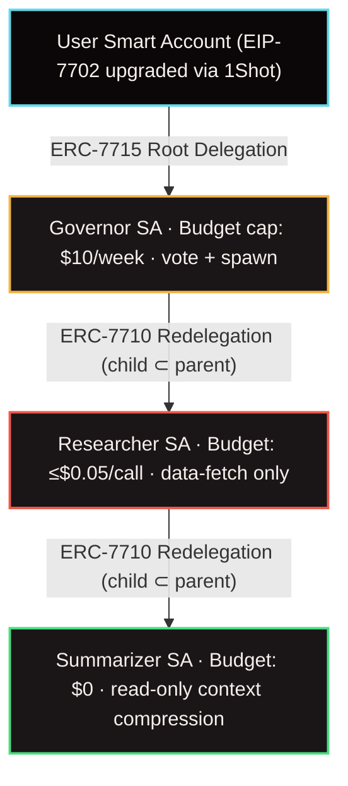

# Vectis — Wallet with Opinions

> A living, thinking, autonomous on-chain wallet agent. Give it rules. Give it a budget. Watch it coordinate other agents without ever trusting them with more than they need.

[](https://app-six-khaki-39.vercel.app)
[](https://base.org)
[](https://nextjs.org)
[](https://typescriptlang.org)
[](https://eips.ethereum.org/EIPS/eip-7710)

---

## Live Deployment

**[https://app-six-khaki-39.vercel.app](https://app-six-khaki-39.vercel.app)** — Base Mainnet

---

## What It Does

Most wallets are passive vaults. Vectis gives your wallet three things:

- **Opinions** — rules you set once in plain English (`"Never vote yes on fee increases. Budget: $10/week"`)
- **Memory** — a cryptographically-linked action log with reasoning traces and tx hashes
- **Budget** — a delegated USDC allowance enforced on-chain, not by policy

When the agent needs help, it doesn't trust sub-agents blindly. It **redelegates strictly narrower authority** down a chain — cryptographically enforced at every hop. A child agent literally cannot spend more, reach further, or delegate wider than its parent.

---

## The Redelegation Chain

Every child scope is the *intersection* of the parent's authority and the child's caveats. On-chain caveat enforcers revert any violation at redemption:



**What this means in practice:**

- The Summarizer has a budget of exactly $0 — it literally cannot spend a cent. The chain enforces this, not the code.
- The Researcher can only call targets on the Governor's allowlist. Any wider call reverts on-chain.
- If a sub-agent attempts to redelegate wider than it holds, the redemption is rejected by the caveat enforcer.

---

## Tech Stack

| Layer | Technology |
|---|---|
| Smart Accounts | MetaMask Smart Accounts Kit (ERC-7710 / ERC-7715) |
| Gasless Execution | 1Shot JSON-RPC Relayer (EIP-7702 upgrade + mainnet) |
| Agent Reasoning | Venice AI (llama-3.3-70b, zero-retention, OpenAI-compatible) |
| Micropayments | x402 per-call payments via redelegated authority |
| Frontend | Next.js 16, React 19, TypeScript, Tailwind CSS 4 |
| Chain | Base Mainnet |

---

## How It Works

**1. Setup (once)**
Type rules in plain English. Venice parses them into two categories:
- **Hard constraints → on-chain caveats** (budget cap, per-tx cap, target allowlist, time window)
- **Soft preferences → Governor system prompt** (reasoning guidance, not enforcement)

You sign a 7702 upgrade and root delegation. The agent hierarchy is live.

**2. The Agent Loop**
A task arrives (governance proposal, research request). The Governor:
- Redelegates to the Researcher with a narrowed scope
- Researcher pays Venice for context via x402 (gasless, via 1Shot)
- Researcher redelegates to Summarizer (zero budget, text-only)
- Governor reasons over the summary against your rules (Venice `<think>` trace)
- **ClearSign** — before high-stakes actions, surfaces the full reasoning in plain English for your review
- Executes gaslessly via 1Shot relayer

**3. Memory**
Every action is logged: actor, decision, reasoning trace, x402 cost, tx hash, outcome.

---

## Project Layout

```
/app                          # Next.js application
  /src
    /app                      # Pages and API routes
      /command-center         # Live agent dashboard
      /api/agent              # Agent initialization and task runner
      /api/events             # SSE stream for real-time UI updates
    /components               # UI components (DelegationTree, ClearSign, ActivityFeed)
    /lib
      /agents
        governor.ts           # Core reasoning loop and sub-agent spawning
        memory.ts             # Action log state
      delegation.ts           # ERC-7710/7715 signing and validation
      oneshot.ts              # 1Shot JSON-RPC relayer client
      venice.ts               # Venice AI wrapper (reasoning + rule parsing)
      x402.ts                 # x402 micropayment handling
/docs                         # Architecture, plans, and guides
/dashboard                    # Static mockups and screenshots
```

See [`/docs`](./docs) for architecture deep-dives, build decisions, and the demo guide.

---

## Running Locally

```bash
# Install dependencies
cd app && npm install

# The .env.local is already configured in app/
# Variables needed: VENICE_API_KEY, ONESHOT_API_KEY, BASE_MAINNET_RPC_URL, WALLET_PRIVATE_KEY

# Start the dev server
npm run dev
# → http://localhost:3000
```

The app starts at the wallet connection screen. Connect MetaMask or click **"Launch Live Demo"** to see the full agent pipeline without a wallet.

---

## Key Invariant (What Judges Should Test)

Submit a redemption that attempts to exceed a child's caveat — bypassing the agent code entirely — and it **reverts on-chain**. The enforcement is cryptographic, not policy. See [`docs/test-plan.md`](./docs/test-plan.md) for the full assertion matrix.

---

## Research Foundation

Vectis implements research blueprints from:

- **User Comprehension:** Qin & Duan (2026). *"What I Sign Is Not What I See": Security and Readability of Web3 Signatures.* arXiv:2601.16751 — motivates the ClearSign plain-English validation layer.
- **Agent Delegation:** South, Pentland, et al. (2025). *Authenticated Delegation and Authorized AI Agents.* arXiv:2501.09674 — supports the mathematical attenuation of sub-agent scopes.
- **Multi-Agent Commerce:** Vaziry, Rodriguez Garzon, Küpper (2025). *Towards Multi-Agent Economies: Enhancing A2A with Ledger-Anchored Identities and x402 Micropayments.* arXiv:2507.19550.
- **Payment Safeguards:** Li et al. (2026). *A402: Binding Payments to Service Execution.* arXiv:2603.01179.
- **Agent Safety:** (2026). *SoK: Security of Autonomous LLM Agents in Agentic Commerce.* arXiv:2604.15367.
