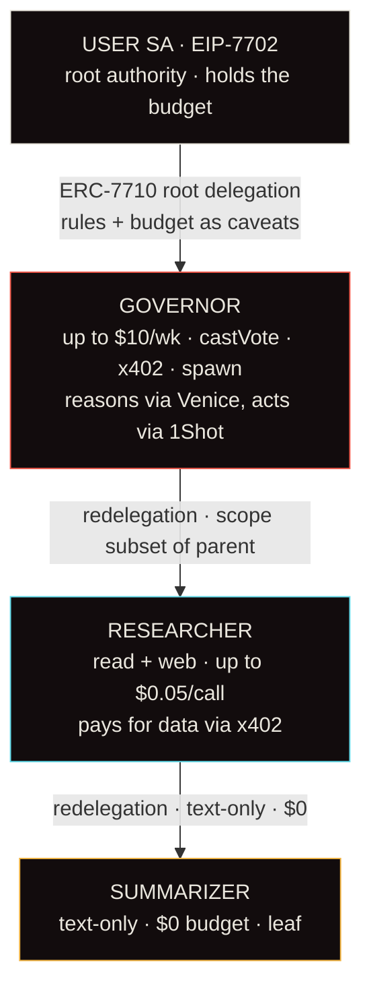

<div align="center">

# Vectis — Wallet with Opinions

### A wallet that doesn't just hold your money. It has opinions, a memory, and a budget — and it coordinates other AI agents without ever trusting them with more power than they need.

[](https://sepolia.basescan.org)
[](https://eips.ethereum.org/EIPS/eip-7710)
[](https://eips.ethereum.org/EIPS/eip-7702)
[](https://www.x402.org)
[](https://nextjs.org)

*MetaMask Smart Accounts Kit · Venice AI · 1Shot Relayer · Base*

### ▶ Live demo — **[wawiop.vercel.app](https://wawiop.vercel.app)**

</div>

> The hosted link is the polished UI showcase. The **full stateful agent pipeline** (live SSE updates, the running loop) is best seen locally with `npm run dev` — Vercel's serverless functions don't persist the in-memory agent state or run fire-and-forget work between requests. The **on-chain proofs run anywhere** via `node app/scripts/prove-all.mjs`.

## On-chain addresses (Base Sepolia · chainId 84532)

| What | Address |
|---|---|
| **DelegationManager** (validates & redeems the chain) | [`0xdb9B1e94B5b69Df7e401DDbedE43491141047dB3`](https://sepolia.basescan.org/address/0xdb9B1e94B5b69Df7e401DDbedE43491141047dB3) |
| **User Smart Account** (EIP-7702 DeleGator, holds the budget) | [`0xC2B7C2B9C923941A14b3e1f42897b1769EEA28C3`](https://sepolia.basescan.org/address/0xC2B7C2B9C923941A14b3e1f42897b1769EEA28C3) |
| **EIP-7702 Stateless DeleGator impl** | [`0x63c0c19a282a1B52b07dD5a65b58948A07DAE32B`](https://sepolia.basescan.org/address/0x63c0c19a282a1B52b07dD5a65b58948A07DAE32B) |
| **USDC** (the delegated asset) | [`0x036CbD53842c5426634e7929541eC2318f3dCF7e`](https://sepolia.basescan.org/address/0x036CbD53842c5426634e7929541eC2318f3dCF7e) |

> Vectis does **not** deploy a bespoke Solidity contract — by design it uses MetaMask's audited
> delegation framework: the `DelegationManager` plus its caveat enforcers (e.g.
> `ERC20TransferAmountEnforcer`) do the on-chain validation and attenuation.

---

## The idea

Most wallets are passive vaults. Vectis gives a wallet three things — **opinions** (rules you set once in plain English), **memory** (a tamper-evident action log), and a **budget** (a delegated USDC allowance) — and it becomes an agent that acts for you.

When it needs help, it doesn't hand other agents the keys. It **redelegates a strictly narrower slice of its own authority** down a chain, cryptographically enforced at every hop. A child agent literally *cannot* spend more, reach further, or delegate wider than its parent — and the chain reverts anything that tries.

> **One primitive, three ways:** the same ERC-7710 delegation engine is the **policy**, the **audit log**, and the **kill switch**.

---

## The redelegation chain (the A2A mechanic)



Every child delegation's on-chain `authority` field is the **keccak hash of its parent**, so the
`DelegationManager` validates the whole chain at redemption. This is a real linked chain — not
independent root delegations.

---

## Everything here is real — and provable on-chain

Run the master proof against the **live Base Sepolia chain** (~5s, no gas):

```bash
cd app && node scripts/prove-all.mjs
```

```
=== VECTIS — REAL BACKEND PROOFS · Base Sepolia (84532) ===
DelegationManager: 0xdb9B1e94B5b69Df7e401DDbedE43491141047dB3

1) LINKED ERC-7710 CHAIN (signed + cryptographically linked)
  [ok] root authority == ROOT
  [ok] Researcher.authority == hash(root)
  [ok] Summarizer.authority == hash(Researcher)
  [ok] every hop carries a 65-byte ECDSA signature

2) VALID REDEMPTION — eth_call against the live DelegationManager
  [ok] redeem 0.10 USDC SIMULATION SUCCEEDED — chain is valid & redeemable on-chain

3) CAVEAT ENFORCEMENT — over-budget redemption REVERTS on-chain
  [ok] reverted: ERC20TransferAmountEnforcer:allowance-exceeded

4) x402 PAYMENT — EIP-3009 signed by Researcher, signature verified
  [ok] payment signature recovers to Researcher

=== 7/7 cryptographic/on-chain checks passed ===
```

See **[`/proofs`](./proofs)** for the full evidence and how each maps to a claim.

| Claim | How it's proven |
|---|---|
| **Linked ERC-7710 chain** | `child.authority == keccak(parent)` for every hop ([`verify-chain.mjs`](./app/scripts/verify-chain.mjs)) |
| **Redeems on a real chain** | live `eth_call redeemDelegations` against `0xdb9B…7dB3` **succeeds** ([`redeem-demo.mjs`](./app/scripts/redeem-demo.mjs)) |
| **Caveats enforced, not policy** | redeeming over budget **reverts** with `ERC20TransferAmountEnforcer:allowance-exceeded` |
| **Real x402 payment** | Researcher signs **EIP-3009 `TransferWithAuthorization`**, server verifies it ([`/api/x402/research`](./app/src/app/api/x402/research/route.ts)) |
| **Real EIP-7702** | `signAuthorization` → Stateless DeleGator impl, submitted by [`upgrade-7702.mjs`](./app/scripts/upgrade-7702.mjs) |
| **Honest reporting** | no fake success tx-hash; the app shows *"SIMULATED VALID"* or the real revert reason |

---

## The Command Center

Three demo beats, each one claim, one click — every pillar made legible:

- **The redelegation chain** — click any node to see its exact caveats; authority bars shrink hop by hop; packets of authority animate down the edges as agents act.
- **Proposal vote** — the agent reads a fee-increase proposal, applies your rule, and votes NO (with a YES counterfactual to prove it reasons, not hardcodes).
- **Unsafe action** — a deliberate over-budget transfer is sent to the live `DelegationManager` and **reverts on-chain**, blocking caveat named in the log.
- **Kill switch** — revoke the root and the entire subtree dies at once; a redemption that worked a minute ago now reverts (cascade revocation).

Plus a live **Venice reasoning** stream, an x402-paid **research pipeline**, the **1Shot relay** lifecycle, and a tamper-evident **memory log** with real explorer links.

---

## Architecture

```
USER EOA --EIP-7702--> USER SMART ACCOUNT (DeleGator)
   |  ERC-7715 grant: budget caveat + rule caveats + expiry
   v
GOVERNOR --Venice: parse rules -> reason -> decide
   |- ERC-7710 redelegate -> RESEARCHER  (x402-pays Venice for data, scope subset of parent)
   |                            \- ERC-7710 redelegate -> SUMMARIZER (text-only, $0)
   \- execute: redeemDelegations -> DelegationManager  (gasless via 1Shot on mainnet)

INVARIANT: child subset of parent at every hop — enforced on-chain at redemption.
```

| Layer | Tech |
|---|---|
| Smart accounts / delegation | MetaMask Smart Accounts Kit (ERC-7710 / 7715 / EIP-7702) |
| Reasoning | Venice AI (`llama-3.3-70b`, zero-retention, OpenAI-compatible) |
| Micropayments | x402 via EIP-3009 `TransferWithAuthorization` |
| Gasless execution | 1Shot JSON-RPC relayer (Base mainnet) |
| Chain | Base Sepolia (real redemption) · Base mainnet (gasless) |
| Frontend | Next.js 16 · React 19 · TypeScript · Tailwind 4 · SSE |

Code map: [`app/src/lib`](./app/src/lib) — `delegation.ts` (linked chain + linkage proof), `onchain.ts` (real redemption + 7702 + simulation), `venice.ts`, `x402.ts`, `oneshot.ts`, `agents/governor.ts` (the loop).

---

## Run it locally

```bash
cd app
npm install
cp .env.example .env.local      # fill in WALLET_PRIVATE_KEY (testnet) + VENICE_API_KEY
npm run dev                     # -> http://localhost:3000
```

- **`/`** — the story (hero + the three pillars + decision flow)
- **`/command-center`** — the live dashboard (click **Launch Live Demo** — no wallet needed)
- **`/onboard`** — connect MetaMask → set rules → sign the root delegation

### Settle a real on-chain redemption
1. Faucet Base Sepolia ETH + test USDC to the User EOA (`scripts/onchain-status.mjs` shows the address).
2. Fund the Governor address with a little ETH (it's the redeemer / gas payer).
3. `node scripts/redeem-demo.mjs --send` → prints the basescan link.

Full guide: [`app/scripts/README.md`](./app/scripts/README.md).

---

## Deploy

[](https://vercel.com/new/clone?repository-url=https://github.com/harsh11067/wawiop&root-directory=app&project-name=wawiop&env=ACTIVE_CHAIN_ID,WALLET_PRIVATE_KEY,VENICE_API_KEY,BASE_SEPOLIA_RPC_URL&envDescription=Testnet%20signer%20%2B%20Venice%20key%20(see%20.env.example))

1. **Import** `wawiop` at [vercel.com/new](https://vercel.com/new) (or use the button) and set **Root Directory = `app`**.
2. Add environment variables (server-side; see [`.env.example`](./app/.env.example)):
   - `ACTIVE_CHAIN_ID=84532`
   - `WALLET_PRIVATE_KEY` — a **testnet** key (optional; without it the app uses an ephemeral signer and still renders + proves chain linkage)
   - `VENICE_API_KEY` — optional (no credits → deterministic fallback)
   - `BASE_SEPOLIA_RPC_URL` — optional (public fallback used otherwise)
3. **Deploy.** Every push to `main` auto-deploys.

The UI, the interactive chain, the demo beats, and the live `eth_call` on-chain
simulations all work on a fresh deploy; add `WALLET_PRIVATE_KEY` (funded testnet
account) for fully settled redemptions.

---

## Honest status

- **Base Sepolia** is the default (real on-chain redemption). 1Shot is mainnet-only, so on testnet the app redeems directly via the `DelegationManager`.
- **Venice** runs live when the API key has credits; otherwise it falls back to deterministic templates and **says so** in the header (`VENICE · NO CREDITS`).
- On-chain settlement is **simulated via `eth_call`** (proving validity) unless the agent accounts are funded for gas — the app never fakes a settled transaction.

---

## Research foundation

- South, Pentland et al. (2025). *Authenticated Delegation and Authorized AI Agents.* arXiv:2501.09674 — attenuated delegation.
- *SoK: Security & Privacy of AI Agents for Blockchain* (2025). arXiv:2509.07131 · *New Vectors of AI Harm* (2025). arXiv:2507.08249 — on-chain policy, audit log, kill switches.
- Qin & Duan (2026). *"What I Sign Is Not What I See."* arXiv:2601.16751 — the ClearSign readability layer.
- Li et al. (2026). *A402: Binding Payments to Service Execution.* arXiv:2603.01179 — x402 proof-of-delivery.

<div align="center">

**Opinions. Memory. Budget.** — the first wallet with something to say, and the discipline to coordinate other agents without trusting them.

</div>
